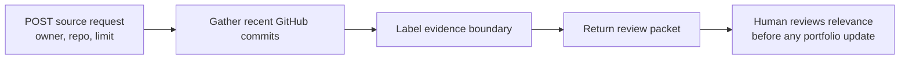

# Week 4 Automation Workflow: Source-Grounded Repository Brief

## Purpose

This is a small, importable **visual no-code workflow** for collecting the current README from a public GitHub repository and returning a deliberately constrained review packet. It is a source-gathering pipeline, not an autonomous writing or publishing system.



## Handoffs and configuration

| Step | n8n node | Input | Output | Responsibility |
| --- | --- | --- | --- | --- |
| 1 | Webhook: `weekly-repository-brief` | JSON with public `owner`, `repo`, and optional `limit` | Source request | Starts one explicit run. |
| 2 | HTTP Request | Request fields | Current public repository README | Retrieves public source data, without credentials. |
| 3 | Edit Fields | README source | `source_label` and `human_review_required` fields | Makes the evidence and review boundary visible. |
| 4 | Respond to Webhook | Labelled item(s) | JSON review packet | Returns results to the caller; does not publish anything. |

The portable n8n import is [`automation/weekly-repository-brief.n8n.json`](../automation/weekly-repository-brief.n8n.json). It uses only webhook, HTTP Request, Edit Fields, and Respond to Webhook nodes—no custom code node and no external credential. For local execution evidence, the equivalent Node-RED visual flow is [`automation/weekly-repository-brief.node-red.json`](../automation/weekly-repository-brief.node-red.json).

> The local n8n package could not be installed in this sandbox because its dependency tree contains a policy-blocked exotic subdependency. The workflow is therefore preserved as an importable n8n artifact, while the equivalent local Node-RED flow is used only to verify the same no-code webhook → gather → format/review handoffs. No cloud n8n, Claude Project, NotebookLM, or other private account is claimed.

## Local run instructions

```bash
pnpm install
pnpm run workflow:local
```

Import the flow listed by `pnpm run workflow:flow` in the local Node-RED interface, deploy it, then send one request per source:

```bash
curl -X POST http://127.0.0.1:5678/webhook/weekly-repository-brief \
  -H 'content-type: application/json' \
  --data '{"owner":"iotserver24","repo":"flyrank-capstone-metering-billing","limit":3}'
```

## Five required source runs

| Run | Public input | Local execution status | Timing | Result boundary |
| --- | --- | --- | --- | --- |
| 1 | `iotserver24/flyrank-capstone-metering-billing` | Workflow received the input but the visual HTTP node returned GitHub `403`. | 0.232240 s | No source result; not a successful run. |
| 2 | `iotserver24/flyrank-be-07-llm` | Workflow received the input but the visual HTTP node returned GitHub `403`. | 0.188720 s | No source result; not a successful run. |
| 3 | `iotserver24/flyrank-be-08-pdf-reports` | Workflow received the input but the visual HTTP node returned GitHub `403`. | 0.179896 s | No source result; not a successful run. |
| 4 | `iotserver24/flyrank-be-06-background-job` | Workflow received the input but the visual HTTP node returned GitHub `403`. | 0.165333 s | No source result; not a successful run. |
| 5 | `iotserver24/flyrank-be09-decision-flow` | Workflow received the input but the visual HTTP node returned GitHub `403`. | 0.177328 s | No source result; not a successful run. |

### Observed local-run boundary

The n8n local package install was blocked by the sandbox’s dependency policy because the current n8n dependency tree includes an exotic subdependency. The equivalent Node-RED visual flow was started successfully and received all five inputs, but its HTTP Request node returned GitHub `403` for each source. The run was retried after disabling proxy variables, adding an explicit GitHub user agent, changing from the commits API to raw README URLs, and adding `NO_PROXY` coverage for GitHub domains. The same public README URL returned `HTTP:200` when directly requested with `curl --noproxy '*'`.

This demonstrates an environment-specific Node-RED outbound-request restriction, not a successful source-gathering run. The five raw response files are retained under `evidence/automation-runs/` as failure evidence. **This Week 4 automation deliverable is not submitted or represented as complete.** A successful run requires the participant to import the portable flow into a normal n8n/Node-RED installation or other supported no-code account and run the five listed public inputs.

## Time accounting

The observed run log records wall-clock request time for each of the five source inputs. Setup time includes dependency installation, importing, and activating the workflow. A manual comparison is intentionally not estimated until five successful source-returning requests have been observed; this avoids inventing a time-saving claim.

## Known failure points and human checks

1. GitHub can rate-limit anonymous API requests or change response fields.
2. A README is not proof of functionality, authorship, quality, or impact.
3. Repository names are public input and should be reviewed before a request is sent.
4. The operator must inspect returned source text and choose whether it is relevant; the workflow does not make that judgment.
5. This local workflow is not publicly hosted or scheduled. It demonstrates the flow and its handoffs, not an always-on automation service.
