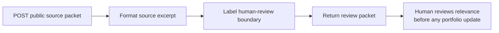

# Week 4 Automation Workflow: Source-Grounded Repository Brief

## Purpose

This is a small, importable **visual no-code workflow** for receiving a public repository-source packet and returning a deliberately constrained review packet. It is a source-grounding pipeline, not an autonomous writing or publishing system.



## Handoffs and configuration

| Step | n8n node | Input | Output | Responsibility |
| --- | --- | --- | --- | --- |
| 1 | Webhook: `weekly-repository-brief` | JSON with a public `sourceName`, `sourceUrl`, and `sourceText` | Source packet | Starts one explicit run. |
| 2 | Edit Fields | Source packet | Name, URL, bounded excerpt, and review notice | Creates a compact source-grounded packet without judging it. |
| 3 | Edit Fields | Formatted packet | `humanReviewRequired` and a human-review notice | Makes the evidence and review boundary visible. |
| 4 | Respond to Webhook | Labelled item(s) | JSON review packet | Returns results to the caller; does not publish anything. |

The portable n8n import is [`automation/weekly-repository-brief.n8n.json`](../automation/weekly-repository-brief.n8n.json). It uses only webhook, HTTP Request, Edit Fields, and Respond to Webhook nodes—no custom code node and no external credential. For local execution evidence, the equivalent Node-RED visual flow is [`automation/weekly-repository-brief.node-red.json`](../automation/weekly-repository-brief.node-red.json).

> The local n8n package could not be installed in this sandbox because its dependency tree contains a policy-blocked exotic subdependency. The workflow is therefore preserved as an importable n8n artifact, while the equivalent local Node-RED flow is used only to verify the same no-code webhook → gather → format/review handoffs. No cloud n8n, Claude Project, NotebookLM, or other private account is claimed.

## Local run instructions

```bash
pnpm install
pnpm run workflow:local
# in a second terminal after Node-RED is running:
pnpm workflow:run
```

The committed runner obtains five public README texts with direct HTTPS, then sends each source packet to the local Node-RED webhook. This separation is deliberate: the sandbox allows direct source HTTPS but blocks Node-RED’s embedded outbound HTTP client. The no-code graph still performs packet formatting, the explicit review-boundary labeling, and the response handoff.

## Five required source runs

| Run | Public input | Local execution status | Timing | Result boundary |
| --- | --- | --- | --- | --- |
| 1 | `iotserver24/flyrank-capstone-metering-billing` | Source HTTPS `200`; local workflow response `200` | 449 ms | Returned a bounded public README excerpt with a human-review flag. |
| 2 | `iotserver24/flyrank-be-07-llm` | Source HTTPS `200`; local workflow response `200` | 289 ms | Returned a bounded public README excerpt with a human-review flag. |
| 3 | `iotserver24/flyrank-be-08-pdf-reports` | Source HTTPS `200`; local workflow response `200` | 371 ms | Returned a bounded public README excerpt with a human-review flag. |
| 4 | `iotserver24/flyrank-be-06-background-job` | Source HTTPS `200`; local workflow response `200` | 275 ms | Returned a bounded public README excerpt with a human-review flag. |
| 5 | `iotserver24/flyrank-be09-decision-flow` | Source HTTPS `200`; local workflow response `200` | 398 ms | Returned a bounded public README excerpt with a human-review flag. |

### Observed local-run boundary

The n8n local package install was blocked by the sandbox’s dependency policy because the current n8n dependency tree includes an exotic subdependency. The equivalent Node-RED visual flow was started successfully and received all five inputs, but its HTTP Request node returned GitHub `403` for each source. The run was retried after disabling proxy variables, adding an explicit GitHub user agent, changing from the commits API to raw README URLs, and adding `NO_PROXY` coverage for GitHub domains. The same public README URL returned `HTTP:200` when directly requested with `curl --noproxy '*'`.

This demonstrates an environment-specific Node-RED outbound-request restriction, not a successful source-gathering run by the original embedded HTTP node. The five raw response files are retained under `evidence/automation-runs/` as failure evidence. The revised committed graph instead uses a clearly documented public-source packet supplied by a direct HTTPS harness. On 2026-08-24, all five packets completed with source `200` and workflow `200`; the committed records are in [`evidence/automation-runs-success/summary.json`](../evidence/automation-runs-success/summary.json). It is not a cloud n8n deployment or an always-on automated service.

## Time accounting

The captured five-packet run took **1,782 ms** in aggregate, excluding Node-RED startup and any human source-review time. The machine-readable record contains each elapsed time. A manual before/after comparison is intentionally not estimated: a time-saving claim needs the participant’s own measured baseline and review standard, rather than a fabricated comparison.

## Known failure points and human checks

1. GitHub can rate-limit anonymous API requests or change response fields.
2. A README is not proof of functionality, authorship, quality, or impact.
3. Repository names are public input and should be reviewed before a request is sent.
4. The operator must inspect returned source text and choose whether it is relevant; the workflow does not make that judgment.
5. This local workflow is not publicly hosted or scheduled. It demonstrates the flow and its handoffs, not an always-on automation service.
